# Diagram przepływu autentykacji - FlashCardsMemory

## Przegląd

Ten diagram przedstawia kompleksowy przepływ autentykacji w aplikacji FlashCardsMemory, obejmujący:
- Rejestrację nowego użytkownika z weryfikacją email
- Logowanie użytkownika
- Dostęp do chronionych stron z automatycznym odświeżaniem tokenów
- Resetowanie hasła
- Wylogowanie

## Diagram sekwencji

```mermaid
sequenceDiagram
    autonumber
    participant Przeglądarka
    participant Middleware
    participant AstroAPI as Astro API
    participant SupabaseAuth as Supabase Auth
    
    Note over Przeglądarka,SupabaseAuth: REJESTRACJA NOWEGO UŻYTKOWNIKA
    
    Przeglądarka->>Przeglądarka: Użytkownik wypełnia formularz rejestracji
    Przeglądarka->>Przeglądarka: Walidacja client-side (Zod)
    Przeglądarka->>AstroAPI: POST /api/auth/register<br/>(email, hasło)
    AstroAPI->>AstroAPI: Walidacja danych (Zod)
    AstroAPI->>SupabaseAuth: signUp(email, hasło)
    SupabaseAuth->>SupabaseAuth: Utworzenie użytkownika<br/>(status: unconfirmed)
    SupabaseAuth->>SupabaseAuth: Generowanie tokenu weryfikacyjnego
    SupabaseAuth-->>Przeglądarka: Wysłanie emaila weryfikacyjnego
    SupabaseAuth-->>AstroAPI: Sukces
    AstroAPI-->>Przeglądarka: 201 Created<br/>(komunikat o weryfikacji)
    Przeglądarka->>Przeglądarka: Wyświetlenie komunikatu:<br/>Sprawdź email
    
    Note over Przeglądarka,SupabaseAuth: WERYFIKACJA EMAIL
    
    Przeglądarka->>Przeglądarka: Użytkownik otwiera email
    Przeglądarka->>Przeglądarka: Kliknięcie w link weryfikacyjny
    Przeglądarka->>AstroAPI: GET /auth/callback?code=xyz
    AstroAPI->>SupabaseAuth: exchangeCodeForSession(code)
    SupabaseAuth->>SupabaseAuth: Weryfikacja kodu
    SupabaseAuth->>SupabaseAuth: Zmiana statusu na confirmed
    SupabaseAuth->>SupabaseAuth: Utworzenie sesji JWT
    SupabaseAuth-->>AstroAPI: Sesja utworzona
    AstroAPI->>Przeglądarka: Set-Cookie: sesja JWT
    AstroAPI-->>Przeglądarka: Redirect /dashboard
    
    Note over Przeglądarka,SupabaseAuth: LOGOWANIE UŻYTKOWNIKA
    
    Przeglądarka->>Przeglądarka: Użytkownik wypełnia formularz logowania
    Przeglądarka->>Przeglądarka: Walidacja client-side (Zod)
    Przeglądarka->>AstroAPI: POST /api/auth/login<br/>(email, hasło)
    AstroAPI->>AstroAPI: Walidacja danych
    AstroAPI->>SupabaseAuth: signInWithPassword(email, hasło)
    SupabaseAuth->>SupabaseAuth: Weryfikacja credentials
    SupabaseAuth->>SupabaseAuth: Sprawdzenie statusu email
    
    alt Email niezweryfikowany
        SupabaseAuth-->>AstroAPI: Błąd: Email not confirmed
        AstroAPI-->>Przeglądarka: 403 Forbidden<br/>Konto niezweryfikowane
        Przeglądarka->>Przeglądarka: Wyświetlenie błędu
    else Nieprawidłowe dane
        SupabaseAuth-->>AstroAPI: Błąd: Invalid credentials
        AstroAPI-->>Przeglądarka: 401 Unauthorized<br/>Nieprawidłowy email lub hasło
        Przeglądarka->>Przeglądarka: Wyświetlenie błędu
    else Logowanie poprawne
        SupabaseAuth->>SupabaseAuth: Utworzenie sesji JWT
        SupabaseAuth-->>AstroAPI: Sesja utworzona
        AstroAPI->>Przeglądarka: Set-Cookie: sesja JWT
        AstroAPI-->>Przeglądarka: 200 OK
        Przeglądarka->>Przeglądarka: Przekierowanie na /dashboard
    end
    
    Note over Przeglądarka,SupabaseAuth: DOSTĘP DO CHRONIONEJ STRONY
    
    Przeglądarka->>Middleware: GET /dashboard
    Middleware->>Middleware: Odczyt cookie sesji
    Middleware->>SupabaseAuth: getSession()
    SupabaseAuth->>SupabaseAuth: Weryfikacja JWT
    
    alt Token ważny
        SupabaseAuth-->>Middleware: Sesja aktywna
        Middleware->>Middleware: Dodanie user do context.locals
        Middleware->>Przeglądarka: Kontynuacja requestu
        Przeglądarka->>Przeglądarka: Renderowanie /dashboard
    else Token wygasł - refresh token ważny
        SupabaseAuth->>SupabaseAuth: Sprawdzenie refresh token
        SupabaseAuth->>SupabaseAuth: Generowanie nowego access token
        SupabaseAuth-->>Middleware: Nowa sesja
        Middleware->>Przeglądarka: Set-Cookie: nowy JWT
        Middleware->>Middleware: Dodanie user do context.locals
        Middleware->>Przeglądarka: Kontynuacja requestu
        Przeglądarka->>Przeglądarka: Renderowanie /dashboard
    else Token wygasł - refresh token wygasł
        SupabaseAuth-->>Middleware: Brak sesji
        Middleware-->>Przeglądarka: Redirect /login?redirect=/dashboard
        Przeglądarka->>Przeglądarka: Renderowanie /login
    end
    
    Note over Przeglądarka,SupabaseAuth: RESETOWANIE HASŁA
    
    Przeglądarka->>Przeglądarka: Użytkownik wpisuje email
    Przeglądarka->>AstroAPI: POST /api/auth/reset-password<br/>(email)
    AstroAPI->>SupabaseAuth: resetPasswordForEmail(email)
    SupabaseAuth->>SupabaseAuth: Generowanie tokenu recovery
    SupabaseAuth-->>Przeglądarka: Wysłanie emaila z linkiem
    SupabaseAuth-->>AstroAPI: Sukces
    AstroAPI-->>Przeglądarka: 200 OK<br/>Link wysłany
    Przeglądarka->>Przeglądarka: Wyświetlenie komunikatu
    Przeglądarka->>Przeglądarka: Użytkownik otwiera email
    Przeglądarka->>Przeglądarka: Kliknięcie w link
    Przeglądarka->>AstroAPI: GET /reset-password?token=abc&type=recovery
    AstroAPI->>SupabaseAuth: verifyOtp(token, type: recovery)
    SupabaseAuth->>SupabaseAuth: Weryfikacja tokenu
    
    alt Token ważny
        SupabaseAuth->>SupabaseAuth: Utworzenie sesji recovery
        SupabaseAuth-->>AstroAPI: Token poprawny
        AstroAPI-->>Przeglądarka: Renderowanie formularza nowego hasła
        Przeglądarka->>Przeglądarka: Użytkownik wpisuje nowe hasło
        Przeglądarka->>AstroAPI: POST /api/auth/update-password<br/>(nowe hasło)
        AstroAPI->>SupabaseAuth: updateUser(password)
        SupabaseAuth->>SupabaseAuth: Aktualizacja hasła
        SupabaseAuth-->>AstroAPI: Hasło zmienione
        AstroAPI-->>Przeglądarka: 200 OK
        Przeglądarka->>Przeglądarka: Redirect /login<br/>Komunikat: Hasło zmienione
    else Token wygasł
        SupabaseAuth-->>AstroAPI: Token nieprawidłowy
        AstroAPI-->>Przeglądarka: Błąd: Link wygasł
        Przeglądarka->>Przeglądarka: Wyświetlenie błędu
    end
    
    Note over Przeglądarka,SupabaseAuth: WYLOGOWANIE
    
    Przeglądarka->>Przeglądarka: Użytkownik klika Wyloguj
    Przeglądarka->>AstroAPI: GET /logout
    AstroAPI->>SupabaseAuth: signOut()
    SupabaseAuth->>SupabaseAuth: Unieważnienie sesji
    SupabaseAuth-->>AstroAPI: Sesja zakończona
    AstroAPI->>Przeglądarka: Delete-Cookie: sesja JWT
    AstroAPI-->>Przeglądarka: Redirect /login
    Przeglądarka->>Przeglądarka: Renderowanie /login
```

## Opis przepływów

### 1. Rejestracja nowego użytkownika (kroki 1-13)
- Użytkownik wypełnia formularz rejestracji z emailem i hasłem
- Walidacja odbywa się zarówno po stronie klienta (Zod), jak i serwera
- Supabase tworzy użytkownika ze statusem "unconfirmed"
- Email weryfikacyjny jest wysyłany automatycznie
- Po kliknięciu w link, kod jest wymieniany na sesję JWT
- Użytkownik zostaje automatycznie zalogowany i przekierowany na dashboard

### 2. Logowanie użytkownika (kroki 14-27)
- Użytkownik wypełnia formularz logowania
- System weryfikuje credentials przez Supabase Auth
- Obsługiwane są różne scenariusze błędów (niezweryfikowany email, nieprawidłowe dane)
- Po pomyślnym logowaniu tworzona jest sesja JWT przechowywana w cookie
- Użytkownik zostaje przekierowany na dashboard

### 3. Dostęp do chronionej strony (kroki 28-45)
- Każdy request do chronionej strony przechodzi przez middleware
- Middleware sprawdza ważność tokenu JWT
- Jeśli access token wygasł, automatycznie używany jest refresh token
- Jeśli refresh token również wygasł, użytkownik zostaje przekierowany na login
- System zapewnia płynne doświadczenie bez konieczności ponownego logowania

### 4. Resetowanie hasła (kroki 46-70)
- Użytkownik wpisuje email na stronie resetowania hasła
- System wysyła email z jednorazowym linkiem recovery (ważny 24h)
- Po kliknięciu w link, token jest weryfikowany
- Użytkownik może ustawić nowe hasło
- Po zmianie hasła użytkownik jest przekierowany na stronę logowania

### 5. Wylogowanie (kroki 71-78)
- Użytkownik klika przycisk "Wyloguj"
- System wywołuje signOut() w Supabase Auth
- Sesja jest unieważniana, a cookie usuwane
- Użytkownik zostaje przekierowany na stronę logowania

## Kluczowe mechanizmy bezpieczeństwa

1. **Tokeny JWT**: Access token (1h) i refresh token (30 dni)
2. **HttpOnly cookies**: Tokeny niedostępne dla JavaScript
3. **Automatyczne odświeżanie**: Middleware transparentnie odświeża wygasłe tokeny
4. **Row Level Security**: Supabase RLS zapewnia izolację danych użytkowników
5. **Weryfikacja email**: Wymagana przed pełnym dostępem do aplikacji
6. **Jednorazowe tokeny**: Tokeny recovery są jednorazowe i mają krótki czas życia

## Aktorzy systemu

- **Przeglądarka**: Interfejs użytkownika, wykonuje walidację client-side
- **Middleware**: Zarządza sesjami, odświeża tokeny, chroni ścieżki
- **Astro API**: Endpointy autentykacji, walidacja server-side
- **Supabase Auth**: Zarządzanie użytkownikami, tokenami i sesjami

## Powiązane dokumenty

- [Specyfikacja autentykacji](../.ai/auth-spec.md)
- [Dokument wymagań produktu](../.ai/prd.md)
- [Architektura autentykacji](../memory-bank/authentication-architecture.md)

---

**Wersja**: 1.0  
**Data utworzenia**: 2026-02-01  
**Autor**: AI Assistant  
**Status**: Gotowy do review
