# Diagram podróży użytkownika - FlashCardsMemory

## Przegląd

Ten diagram przedstawia kompleksową podróż użytkownika w aplikacji FlashCardsMemory, obejmującą wszystkie główne ścieżki autentykacji i korzystania z aplikacji.

## Główne ścieżki użytkownika

### 1. Rejestracja nowego użytkownika (US-001)
- Użytkownik wypełnia formularz rejestracji (email, hasło, potwierdzenie hasła)
- System waliduje dane i sprawdza czy email nie istnieje
- Wysyłany jest email weryfikacyjny
- Użytkownik klika link w emailu
- Konto zostaje aktywowane i użytkownik jest automatycznie zalogowany

### 2. Logowanie istniejącego użytkownika (US-002)
- Użytkownik wypełnia formularz logowania (email, hasło)
- System weryfikuje credentials i status weryfikacji email
- Po pomyślnym logowaniu użytkownik jest przekierowany na dashboard
- Sesja jest utrzymywana między odświeżeniami strony

### 3. Resetowanie hasła (US-004)
- Użytkownik wpisuje email na stronie resetowania hasła
- System wysyła email z linkiem resetującym (ważny 24h)
- Użytkownik klika link i wpisuje nowe hasło
- Po zmianie hasła użytkownik jest przekierowany na stronę logowania

### 4. Ochrona chronionych stron
- Middleware sprawdza sesję przy każdym żądaniu do chronionej strony
- Jeśli brak sesji, użytkownik jest przekierowany na login z parametrem redirect
- Po zalogowaniu użytkownik wraca na oryginalną stronę

### 5. Wylogowanie (US-003)
- Użytkownik klika przycisk "Wyloguj" w nawigacji
- Sesja jest zakończona w Supabase
- Użytkownik jest przekierowany na stronę logowania

## Diagram podróży użytkownika

```mermaid
stateDiagram-v2
    [*] --> StronaGlowna
    
    state "Strona Główna" as StronaGlowna
    StronaGlowna --> DecyzjaMaKonto
    
    state DecyzjaMaKonto <<choice>>
    DecyzjaMaKonto --> FormularzLogowania: Mam konto
    DecyzjaMaKonto --> FormularzRejestracji: Nie mam konta
    
    state "Proces Autentykacji" as Autentykacja {
        state "Proces Logowania" as ProcesLogowania {
            state "Formularz Logowania" as FormularzLogowania
            FormularzLogowania --> WalidacjaLogowania
            
            state "Walidacja Danych" as WalidacjaLogowania
            WalidacjaLogowania --> DecyzjaLogowanie
            
            state DecyzjaLogowanie <<choice>>
            DecyzjaLogowanie --> BladLogowania: Dane niepoprawne
            DecyzjaLogowanie --> SprawdzenieWeryfikacji: Dane poprawne
            
            state "Błąd Logowania" as BladLogowania
            BladLogowania --> FormularzLogowania: Popraw dane
            
            state "Sprawdzenie Weryfikacji Email" as SprawdzenieWeryfikacji
            SprawdzenieWeryfikacji --> DecyzjaWeryfikacja
            
            state DecyzjaWeryfikacja <<choice>>
            DecyzjaWeryfikacja --> BladWeryfikacji: Email niezweryfikowany
            DecyzjaWeryfikacja --> UtworzenieSesji: Email zweryfikowany
            
            state "Błąd Weryfikacji" as BladWeryfikacji
            BladWeryfikacji --> FormularzLogowania
            
            state "Utworzenie Sesji" as UtworzenieSesji
        }
        
        state "Proces Rejestracji" as ProcesRejestracji {
            state "Formularz Rejestracji" as FormularzRejestracji
            FormularzRejestracji --> WalidacjaRejestracji
            
            state "Walidacja Danych" as WalidacjaRejestracji
            WalidacjaRejestracji --> DecyzjaRejestracja
            
            state DecyzjaRejestracja <<choice>>
            DecyzjaRejestracja --> BladRejestracji: Błąd walidacji
            DecyzjaRejestracja --> SprawdzenieEmailIstnieje: Dane poprawne
            
            state "Błąd Rejestracji" as BladRejestracji
            BladRejestracji --> FormularzRejestracji: Popraw dane
            
            state "Sprawdzenie Email" as SprawdzenieEmailIstnieje
            SprawdzenieEmailIstnieje --> DecyzjaEmailIstnieje
            
            state DecyzjaEmailIstnieje <<choice>>
            DecyzjaEmailIstnieje --> EmailJuzIstnieje: Email zajęty
            DecyzjaEmailIstnieje --> WyslanieEmailaWeryfikacyjnego: Email wolny
            
            state "Email Już Istnieje" as EmailJuzIstnieje
            EmailJuzIstnieje --> FormularzRejestracji
            
            state fork_rejestracja <<fork>>
            state join_rejestracja <<join>>
            
            state "Wysłanie Emaila" as WyslanieEmailaWeryfikacyjnego
            WyslanieEmailaWeryfikacyjnego --> fork_rejestracja
            fork_rejestracja --> UtworzKontoWBazie
            fork_rejestracja --> WyslijEmail
            
            state "Utwórz Konto w Bazie" as UtworzKontoWBazie
            state "Wyślij Email" as WyslijEmail
            
            UtworzKontoWBazie --> join_rejestracja
            WyslijEmail --> join_rejestracja
            join_rejestracja --> KomunikatSukcesu
            
            state "Komunikat Sukcesu" as KomunikatSukcesu
            KomunikatSukcesu --> OczekiwanieNaWeryfikacje
            
            state "Oczekiwanie na Weryfikację" as OczekiwanieNaWeryfikacje
            OczekiwanieNaWeryfikacje --> KlikniecieLinkuWEmail
            
            state "Kliknięcie Linku w Email" as KlikniecieLinkuWEmail
            KlikniecieLinkuWEmail --> CallbackWeryfikacji
            
            state "Callback Weryfikacji" as CallbackWeryfikacji
            CallbackWeryfikacji --> DecyzjaTokenWeryfikacji
            
            state DecyzjaTokenWeryfikacji <<choice>>
            DecyzjaTokenWeryfikacji --> BladTokenu: Token nieprawidłowy
            DecyzjaTokenWeryfikacji --> PotwierdzKonto: Token prawidłowy
            
            state "Błąd Tokenu" as BladTokenu
            BladTokenu --> FormularzLogowania
            
            state "Potwierdź Konto" as PotwierdzKonto
            PotwierdzKonto --> UtworzenieSesjiPoRejestracji
            
            state "Utworzenie Sesji" as UtworzenieSesjiPoRejestracji
        }
        
        state "Proces Resetowania Hasła" as ProcesResetowania {
            state "Formularz Reset Hasła" as FormularzResetHasla
            FormularzResetHasla --> WalidacjaEmailReset
            
            state "Walidacja Email" as WalidacjaEmailReset
            WalidacjaEmailReset --> WyslanieEmailaResetujacego
            
            state "Wysłanie Emaila Resetującego" as WyslanieEmailaResetujacego
            WyslanieEmailaResetujacego --> KomunikatWyslanoEmail
            
            state "Komunikat Wysłano Email" as KomunikatWyslanoEmail
            KomunikatWyslanoEmail --> KlikniecieLinkuReset
            
            state "Kliknięcie Linku Reset" as KlikniecieLinkuReset
            KlikniecieLinkuReset --> WeryfikacjaTokenuReset
            
            state "Weryfikacja Tokenu Reset" as WeryfikacjaTokenuReset
            WeryfikacjaTokenuReset --> DecyzjaTokenReset
            
            state DecyzjaTokenReset <<choice>>
            DecyzjaTokenReset --> TokenWygasl: Token wygasł
            DecyzjaTokenReset --> FormularzNowegoHasla: Token ważny
            
            state "Token Wygasł" as TokenWygasl
            TokenWygasl --> FormularzResetHasla
            
            state "Formularz Nowego Hasła" as FormularzNowegoHasla
            FormularzNowegoHasla --> WalidacjaNowegoHasla
            
            state "Walidacja Nowego Hasła" as WalidacjaNowegoHasla
            WalidacjaNowegoHasla --> DecyzjaWalidacjaHasla
            
            state DecyzjaWalidacjaHasla <<choice>>
            DecyzjaWalidacjaHasla --> BladWalidacjiHasla: Błąd walidacji
            DecyzjaWalidacjaHasla --> AktualizacjaHasla: Hasło poprawne
            
            state "Błąd Walidacji Hasła" as BladWalidacjiHasla
            BladWalidacjiHasla --> FormularzNowegoHasla
            
            state "Aktualizacja Hasła" as AktualizacjaHasla
            AktualizacjaHasla --> KomunikatHasloZmienione
            
            state "Komunikat Hasło Zmienione" as KomunikatHasloZmienione
        }
    }
    
    UtworzenieSesji --> Dashboard
    UtworzenieSesjiPoRejestracji --> Dashboard
    KomunikatHasloZmienione --> FormularzLogowania
    FormularzLogowania --> FormularzResetHasla: Zapomniałeś hasła?
    FormularzRejestracji --> FormularzLogowania: Masz konto?
    
    state "Panel Użytkownika" as PanelUzytkownika {
        state "Dashboard" as Dashboard
        Dashboard --> KorzystanieZAplikacji
        
        state "Korzystanie z Aplikacji" as KorzystanieZAplikacji {
            state "Zarządzanie Taliami" as ZarzadzanieTaliami
            state "Zarządzanie Fiszkami" as ZarzadzanieFiszkami
            state "Generowanie AI" as GenerowanieAI
            state "Sesja Nauki" as SesjaNauki
            
            [*] --> ZarzadzanieTaliami
            ZarzadzanieTaliami --> ZarzadzanieFiszkami
            ZarzadzanieFiszkami --> GenerowanieAI
            GenerowanieAI --> SesjaNauki
            SesjaNauki --> ZarzadzanieTaliami
        }
        
        KorzystanieZAplikacji --> PrzyciskWylogowania
        
        state "Przycisk Wylogowania" as PrzyciskWylogowania
        PrzyciskWylogowania --> ProcesWylogowania
        
        state "Proces Wylogowania" as ProcesWylogowania
        ProcesWylogowania --> ZakonczenieSesji
        
        state "Zakończenie Sesji" as ZakonczenieSesji
    }
    
    ZakonczenieSesji --> FormularzLogowania
    
    state "Ochrona Chronionych Stron" as OchronaStron {
        state "Próba Dostępu do Chronionej Strony" as ProbaDostepu
        ProbaDostepu --> SprawdzenieSesji
        
        state "Sprawdzenie Sesji" as SprawdzenieSesji
        SprawdzenieSesji --> DecyzjaSesja
        
        state DecyzjaSesja <<choice>>
        DecyzjaSesja --> DostepZablokowany: Brak sesji
        DecyzjaSesja --> DostepPrzyznany: Sesja aktywna
        
        state "Dostęp Zablokowany" as DostepZablokowany
        state "Dostęp Przyznany" as DostepPrzyznany
    }
    
    DostepZablokowany --> FormularzLogowania: Przekierowanie z parametrem redirect
    DostepPrzyznany --> Dashboard
    
    Dashboard --> [*]: Zamknięcie aplikacji
    
    note right of FormularzLogowania
        Formularz zawiera pola email i hasło
        oraz linki do rejestracji i resetu hasła
    end note
    
    note right of FormularzRejestracji
        Formularz zawiera email, hasło
        i potwierdzenie hasła
    end note
    
    note right of OczekiwanieNaWeryfikacje
        Użytkownik musi sprawdzić email
        i kliknąć link weryfikacyjny
        Link ważny przez 24 godziny
    end note
    
    note right of Dashboard
        Główny panel z dostępem do:
        - Talii fiszek
        - Generowania AI
        - Sesji nauki
        - Statystyk
    end note
    
    note right of SprawdzenieSesji
        Middleware sprawdza sesję
        dla wszystkich chronionych ścieżek
    end note
```

## Kluczowe punkty decyzyjne

### 1. Czy użytkownik ma konto?
- **TAK**: Przekierowanie na formularz logowania
- **NIE**: Przekierowanie na formularz rejestracji

### 2. Czy dane logowania są poprawne?
- **TAK**: Sprawdzenie weryfikacji email
- **NIE**: Wyświetlenie komunikatu błędu, pozostanie na stronie logowania

### 3. Czy email został zweryfikowany?
- **TAK**: Utworzenie sesji i przekierowanie na dashboard
- **NIE**: Wyświetlenie komunikatu o konieczności weryfikacji email

### 4. Czy email już istnieje w systemie?
- **TAK**: Wyświetlenie błędu "Email już istnieje"
- **NIE**: Kontynuacja procesu rejestracji

### 5. Czy token weryfikacyjny/resetujący jest ważny?
- **TAK**: Kontynuacja procesu (weryfikacja konta lub reset hasła)
- **NIE**: Wyświetlenie komunikatu o wygasłym linku

### 6. Czy użytkownik ma aktywną sesję?
- **TAK**: Dostęp do chronionej strony
- **NIE**: Przekierowanie na login z parametrem redirect

## Stany równoległe w procesie rejestracji

Podczas rejestracji, dwie operacje wykonują się równolegle:
1. **Utworzenie konta w bazie danych** - zapisanie użytkownika w tabeli auth.users
2. **Wysłanie emaila weryfikacyjnego** - wysłanie wiadomości z linkiem aktywacyjnym

Obie operacje muszą zakończyć się sukcesem, aby proces rejestracji został uznany za pomyślny.

## Główne funkcjonalności po zalogowaniu

Po pomyślnym zalogowaniu użytkownik ma dostęp do:
- **Zarządzania Taliami**: Tworzenie, edycja, usuwanie talii fiszek
- **Zarządzania Fiszkami**: Tworzenie, edycja, usuwanie pojedynczych fiszek
- **Generowania AI**: Automatyczne tworzenie fiszek z tekstu źródłowego
- **Sesji Nauki**: Nauka z wykorzystaniem algorytmu FSRS

## Uwagi implementacyjne

### Obecny stan (MVP)
- Aplikacja używa tymczasowego mechanizmu anonimowych użytkowników (cookie `user_id_v2`)
- Strony auth są już utworzone, ale nie są w pełni funkcjonalne
- Middleware nie sprawdza sesji Supabase Auth

### Wymagane zmiany
- Rozszerzenie middleware o obsługę sesji Supabase Auth
- Implementacja API endpoints dla autentykacji
- Przebudowa komponentów React (LoginPage, RegisterPage, ResetPasswordPage)
- Utworzenie stron callback i logout
- Migracja wszystkich API endpoints z anonimowego userId na rzeczywiste auth

## Powiązane dokumenty

- [Specyfikacja autentykacji](../auth-spec.md)
- [Dokument wymagań produktu (PRD)](../prd.md)
- [Diagram architektury autentykacji](./auth.md)
