# Diagram architektury UI - Moduł autentykacji

## Analiza architektury

Diagram przedstawia pełną architekturę interfejsu użytkownika dla modułu autentykacji w aplikacji FlashCardsMemory. Obejmuje:

- **Strony Astro (SSR)**: Renderowanie server-side, sprawdzanie sesji, integracja z komponentami React
- **Komponenty React**: Interaktywne formularze, walidacja client-side, komunikacja z API
- **API Endpoints**: Walidacja danych, integracja z Supabase Auth, obsługa błędów
- **Middleware**: Zarządzanie sesją, ochrona chronionych ścieżek
- **Komponenty UI**: Reużywalne komponenty z Shadcn/ui

## Diagram architektury

```mermaid
flowchart TD
    subgraph "Warstwa Routingu - Strony Astro SSR"
        A1[index.astro]
        A2[login.astro]
        A3[register.astro]
        A4[reset-password.astro]
        A5[auth/callback.astro]
        A6[logout.astro]
        A7[dashboard.astro]
    end

    subgraph "Middleware i Zarządzanie Sesją"
        M1[middleware/index.ts]
        M2{Sprawdzenie sesji}
        M3[Ochrona chronionych ścieżek]
        M4[Odświeżanie tokenów]
    end

    subgraph "Komponenty React - Autentykacja"
        R1[LoginPage.tsx]
        R2[RegisterPage.tsx]
        R3[ResetPasswordPage.tsx]
        R4[AuthErrorAlert.tsx]
    end

    subgraph "Komponenty React - Dashboard"
        D1[DashboardPage.tsx]
        D2[DashboardHeader.tsx]
        D3[TodayStatsCard.tsx]
        D4[DecksOverviewList.tsx]
        D5[QuickActions.tsx]
    end

    subgraph "API Endpoints - Autentykacja"
        API1[POST /api/auth/register]
        API2[POST /api/auth/login]
        API3[POST /api/auth/reset-password]
        API4[POST /api/auth/update-password]
    end

    subgraph "API Endpoints - Funkcjonalności"
        API5[GET /api/dashboard]
        API6[API /api/decks]
        API7[API /api/flashcards]
        API8[API /api/generation-requests]
        API9[API /api/study-sessions]
    end

    subgraph "Komponenty UI - Shadcn/ui"
        UI1[Button]
        UI2[Input]
        UI3[Label]
        UI4[Alert]
        UI5[Card]
    end

    subgraph "Walidacja i Schemat"
        V1[Zod Schema - Login]
        V2[Zod Schema - Register]
        V3[Zod Schema - Reset Password]
    end

    subgraph "Backend - Supabase"
        S1[Supabase Auth]
        S2[Supabase Database]
        S3[Email Service]
    end

    subgraph "Layout i Współdzielone"
        L1[Layout.astro]
        L2[supabase.client.ts]
    end

    %% Przepływ routingu
    A1 -->|Przekierowanie| A2
    A2 -->|Renderuje| R1
    A3 -->|Renderuje| R2
    A4 -->|Renderuje| R3
    A7 -->|Renderuje| D1

    %% Middleware
    M1 --> M2
    M2 -->|Brak sesji| M3
    M2 -->|Sesja istnieje| M4
    M3 -->|Przekierowanie| A2
    M4 -->|Kontynuacja| A7

    %% Komponenty autentykacji używają UI
    R1 --> UI1
    R1 --> UI2
    R1 --> UI3
    R1 --> UI4
    R1 --> UI5
    R2 --> UI1
    R2 --> UI2
    R2 --> UI3
    R2 --> UI4
    R2 --> UI5
    R3 --> UI1
    R3 --> UI2
    R3 --> UI3
    R3 --> UI4
    R3 --> UI5

    %% Walidacja
    R1 --> V1
    R2 --> V2
    R3 --> V3

    %% Komunikacja z API
    R1 -->|POST credentials| API2
    R2 -->|POST user data| API1
    R3 -->|POST email| API3
    R3 -->|POST new password| API4

    %% API do Supabase
    API1 -->|signUp| S1
    API2 -->|signInWithPassword| S1
    API3 -->|resetPasswordForEmail| S1
    API4 -->|updateUser| S1

    %% Email flow
    S1 -->|Wysłanie emaila| S3
    S3 -->|Link weryfikacyjny| A5
    S3 -->|Link resetujący| A4

    %% Callback
    A5 -->|Weryfikacja tokenu| S1
    A5 -->|Przekierowanie| A7

    %% Wylogowanie
    A6 -->|signOut| S1
    A6 -->|Przekierowanie| A2

    %% Dashboard
    D1 --> D2
    D1 --> D3
    D1 --> D4
    D1 --> D5
    D2 -->|Przycisk wyloguj| A6

    %% Dashboard API
    D1 -->|GET| API5
    API5 -->|Query| S2

    %% Layout
    A2 --> L1
    A3 --> L1
    A4 --> L1
    A7 --> L1

    %% Supabase client
    M1 --> L2
    API1 --> L2
    API2 --> L2
    API3 --> L2
    API4 --> L2
    API5 --> L2

    %% Chronione API
    API6 --> M1
    API7 --> M1
    API8 --> M1
    API9 --> M1

    %% Stylizacja węzłów
    classDef newComponent fill:#90EE90,stroke:#2E8B57,stroke-width:3px
    classDef updateComponent fill:#FFD700,stroke:#FF8C00,stroke-width:3px
    classDef existingComponent fill:#87CEEB,stroke:#4682B4,stroke-width:2px
    classDef apiEndpoint fill:#FFB6C1,stroke:#C71585,stroke-width:2px
    classDef backend fill:#DDA0DD,stroke:#8B008B,stroke-width:2px

    %% Nowe komponenty
    class A5,A6,API1,API2,API3,API4,R4 newComponent

    %% Komponenty wymagające aktualizacji
    class R1,R2,R3,D2,M1,A2,A3,A4 updateComponent

    %% Istniejące komponenty
    class A1,A7,D1,D3,D4,D5,UI1,UI2,UI3,UI4,UI5,L1,L2 existingComponent

    %% API endpoints
    class API5,API6,API7,API8,API9 apiEndpoint

    %% Backend
    class S1,S2,S3 backend
```




## Legenda

### Kolory węzłów:
- **Zielony**: Nowe komponenty do utworzenia
- **Żółty**: Istniejące komponenty wymagające aktualizacji
- **Niebieski**: Istniejące komponenty bez zmian
- **Różowy**: API endpoints
- **Fioletowy**: Backend (Supabase)

## Kluczowe przepływy

### 1. Przepływ rejestracji
```
RegisterPage → POST /api/auth/register → Supabase Auth → Email Service 
→ Użytkownik klika link → auth/callback → Weryfikacja → Dashboard
```

### 2. Przepływ logowania
```
LoginPage → POST /api/auth/login → Supabase Auth → Dashboard
```

### 3. Przepływ resetowania hasła
```
ResetPasswordPage → POST /api/auth/reset-password → Email Service 
→ Użytkownik klika link → reset-password (z tokenem) 
→ POST /api/auth/update-password → Login
```

### 4. Przepływ wylogowania
```
DashboardHeader (przycisk wyloguj) → /logout → Supabase Auth → Login
```

### 5. Ochrona chronionych ścieżek
```
Żądanie → Middleware → Sprawdzenie sesji → 
[Brak sesji] → Przekierowanie na /login
[Sesja OK] → Kontynuacja → Strona docelowa
```

## Komponenty wymagające zmian

### Nowe komponenty (zielone):
1. **auth/callback.astro** - Obsługa callback z Supabase po weryfikacji email
2. **logout.astro** - Wylogowanie użytkownika
3. **POST /api/auth/register** - Endpoint rejestracji
4. **POST /api/auth/login** - Endpoint logowania
5. **POST /api/auth/reset-password** - Endpoint żądania resetu hasła
6. **POST /api/auth/update-password** - Endpoint aktualizacji hasła
7. **AuthErrorAlert.tsx** - Reużywalny komponent błędów

### Komponenty do aktualizacji (żółte):
1. **LoginPage.tsx** - Dodanie rzeczywistej komunikacji z API, obsługa błędów
2. **RegisterPage.tsx** - Dodanie komunikacji z API, widok sukcesu
3. **ResetPasswordPage.tsx** - Dodanie dwóch trybów (żądanie + ustawienie hasła)
4. **DashboardHeader.tsx** - Dodanie przycisku wylogowania i emaila użytkownika
5. **middleware/index.ts** - Rozszerzenie o zarządzanie sesją i ochronę ścieżek
6. **login.astro** - Dodanie sprawdzania sesji i obsługi redirect
7. **register.astro** - Dodanie sprawdzania sesji
8. **reset-password.astro** - Dodanie obsługi tokenu recovery

## Zależności między komponentami

### Komponenty autentykacji → Komponenty UI
Wszystkie komponenty autentykacji (LoginPage, RegisterPage, ResetPasswordPage) używają tych samych komponentów UI z Shadcn/ui:
- Button (przyciski akcji)
- Input (pola formularza)
- Label (etykiety pól)
- Alert (komunikaty błędów/sukcesu)
- Card (kontener formularza)

### Komponenty React → API Endpoints
- LoginPage → POST /api/auth/login
- RegisterPage → POST /api/auth/register
- ResetPasswordPage → POST /api/auth/reset-password, POST /api/auth/update-password
- DashboardPage → GET /api/dashboard

### API Endpoints → Supabase
Wszystkie endpointy autentykacji komunikują się z Supabase Auth:
- register → supabase.auth.signUp()
- login → supabase.auth.signInWithPassword()
- reset-password → supabase.auth.resetPasswordForEmail()
- update-password → supabase.auth.updateUser()

### Middleware → Wszystkie strony
Middleware jest wykonywany przed każdym żądaniem i:
- Dodaje klienta Supabase do context.locals
- Sprawdza sesję użytkownika
- Chroni chronione ścieżki
- Odświeża tokeny sesji

## Walidacja danych

### Client-side (Zod):
- **loginSchema**: email (format), password (min 8 znaków)
- **registerSchema**: email, password, confirmPassword (zgodność)
- **resetPasswordSchema**: email (format)

### Server-side (API):
- Walidacja przez Zod w każdym endpoincie
- Dodatkowa walidacja przez Supabase Auth
- Obsługa błędów i mapowanie na komunikaty użytkownika

## Bezpieczeństwo

### Ochrona danych:
- Hasła nigdy nie są logowane
- Tokeny przechowywane w httpOnly cookies
- CSRF protection przez Supabase Auth
- XSS protection przez React i httpOnly cookies

### Ochrona ścieżek:
- Middleware sprawdza sesję przed dostępem do chronionych stron
- Niezalogowani użytkownicy przekierowywani na /login
- Zalogowani użytkownicy nie mogą wejść na /login, /register

## Uwagi implementacyjne

1. **Wszystkie strony autentykacji muszą mieć `export const prerender = false`**
2. **Middleware musi być wykonywany przed wszystkimi żądaniami**
3. **Komponenty React muszą używać `client:load` w stronach Astro**
4. **API endpoints muszą walidować dane przez Zod przed wysłaniem do Supabase**
5. **Email templates muszą być skonfigurowane w Supabase Dashboard**
6. **Redirect URLs muszą być dodane do Supabase Auth Settings**
